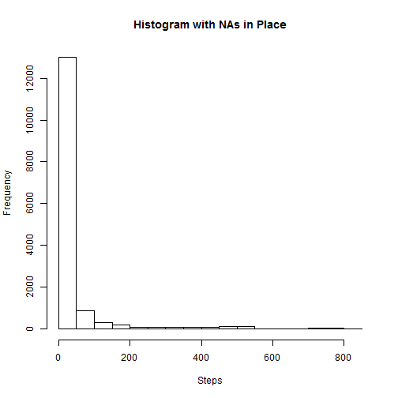
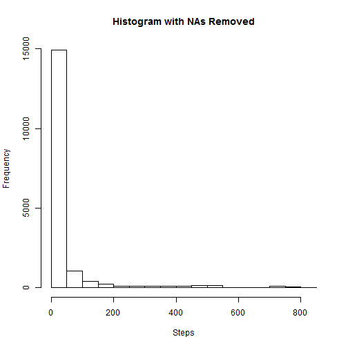
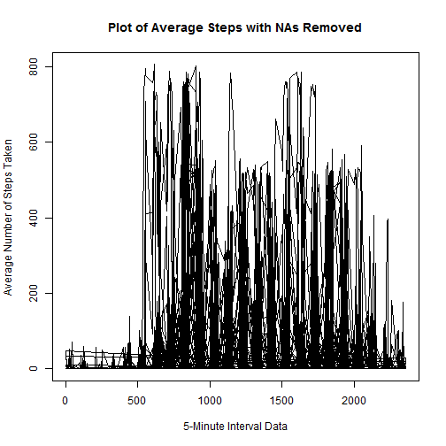
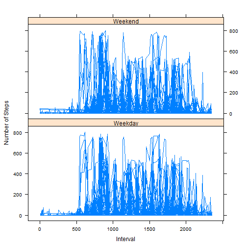

# Reproducible Research: Peer Assessment 1


## Loading and preprocessing the data


```r
data <- read.csv("activity.csv")
```


## What is mean total number of steps taken per day?

```r

hist(data$steps, main = "Histogram with NAs in Place", xlab = "Steps")
```

 

```r

mean(data$steps, na.rm = T)
```

```
## [1] 37.38
```

```r

median(data$steps, na.rm = T)
```

```
## [1] 0
```


## What is the average daily activity pattern?


```r

plot(data$interval, data$steps, type = "l", main = "Plot of Average Steps with NAs in place", 
    xlab = "5-Minute Interval Data", ylab = "Average Number of Steps Taken ")
```

 


## Imputing missing values

```r

stepsNA1ToReplace <- data[data$date == "2012-11-05", ]
stepsNA1ToReplace <- stepsNA1ToReplace$steps

stepsNA2ToReplace <- data[data$date == "2012-11-12", ]
stepsNA2ToReplace <- stepsNA2ToReplace$steps

stepsNA3ToReplace <- data[data$date == "2012-10-04", ]
stepsNA3ToReplace <- stepsNA3ToReplace$steps

stepsNA4ToReplace <- data[data$date == "2012-10-07", ]
stepsNA4ToReplace <- stepsNA4ToReplace$steps

stepsNA5ToReplace <- data[data$date == "2012-10-12", ]
stepsNA5ToReplace <- stepsNA5ToReplace$steps

stepsNA6ToReplace <- data[data$date == "2012-10-13", ]
stepsNA6ToReplace <- stepsNA6ToReplace$steps

stepsNA7ToReplace <- data[data$date == "2012-10-17", ]
stepsNA7ToReplace <- stepsNA7ToReplace$steps

stepsNA8ToReplace <- data[data$date == "2012-11-02", ]
stepsNA8ToReplace <- stepsNA8ToReplace$steps

data$steps[1:288] <- stepsNA1ToReplace
data$steps[2017:2304] <- stepsNA2ToReplace
data$steps[8929:9216] <- stepsNA3ToReplace
data$steps[9793:10080] <- stepsNA4ToReplace
data$steps[11233:11520] <- stepsNA5ToReplace
data$steps[11521:11808] <- stepsNA6ToReplace
data$steps[12673:12960] <- stepsNA7ToReplace
data$steps[17281:17568] <- stepsNA8ToReplace

dataWONAs <- data

hist(dataWONAs$steps, main = "Histogram with NAs Removed", xlab = "Steps")
```

 

```r

mean(dataWONAs$steps)
```

```
## [1] 38.07
```

```r

median(dataWONAs$steps)
```

```
## [1] 0
```

```r

plot(dataWONAs$interval, dataWONAs$steps, type = "l", main = "Plot of Average Steps with NAs Removed", 
    xlab = "5-Minute Interval Data", ylab = "Average Number of Steps Taken ")
```

 


## Are there differences in activity patterns between weekdays and weekends?


```r

dataWONAs[, c(1, 3)] <- sapply(dataWONAs[, c(1, 3)], as.numeric)

wd <- dataWONAs$date
wd <- strptime(wd, "%Y-%m-%d")
wd <- weekdays(wd)
wd <- as.character(wd)

for (i in 1:length(wd)) {
    if (wd[i] == "Saturday" | wd[i] == "Sunday") {
        wd[i] <- "weekend"
    } else {
        wd[i] <- "weekday"
    }
}

dataWONAs$wd <- wd

att = c("Weekend", "Weekday")

library(lattice)
```

```
## Warning: package 'lattice' was built under R version 3.0.3
```

```r

xyplot(dataWONAs$steps ~ dataWONAs$interval | att, layout = c(1, 2), type = "l", 
    xlab = "Interval", ylab = "Number of Steps")
```

 

```r

```

